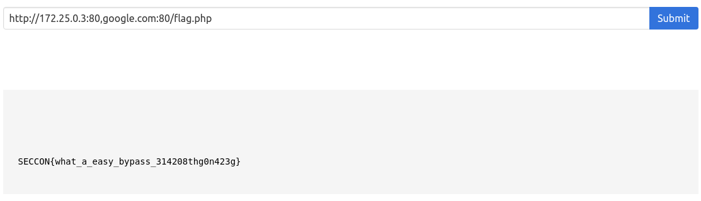

# Option-Cmd-U ([Link](http://ocu.chal.seccon.jp:10000/index.php))

- Đầu tiên nhìn hint mà đề cho trong source

  

- Nhìn thấy có 1 *endpoint* là */flag*, thử vào xem sao

  ```
  Forbidden.Your IP: 58.187.170.188
  ```

- Ta có thể thấy là 1 dòng `Forbidden` cộng với *IP adress public* 

- Để ý thì trong hint có 1 đoạn thế này

  ```
  which permits access only from internal network
  ```

- Tức là phải truy cập bằng mạng nội bộ của nó mới có thể được *accept*, nếu truy cập bằng bất cứ nguồn nào khác mạng nội bộ đều bị cấm

- Hint còn cho ta source của file *index.php*, xem thử nào

  ```php+HTML
  <?php
  if ($_GET['action'] === "source"){
      highlight_file(__FILE__);
      die();
  }
  ?>
  <!DOCTYPE html>
  <html>
      <head>
          <meta charset="utf-8">
          <meta name="viewport" content="width=device-width, initial-scale=1">
          <title>Option-Cmd-U</title>
          <link rel="stylesheet" href="https://cdnjs.cloudflare.com/ajax/libs/bulma/0.7.5/css/bulma.min.css">
          <script defer src="https://use.fontawesome.com/releases/v5.3.1/js/all.js"></script>
      </head>
      <body>
          <div class="container">                
              <section class="hero">
                  <div class="hero-body">
                      <div class="container">
                          <h1 class="title has-text-centered has-text-weight-bold">
                              Option-Cmd-U
                          </h1>
                          <h2 class="subtitle has-text-centered">
                              "View Page Source" is no longer required! Let's view page source online :-)
                          </h2>
                          <form method="GET">
                              <div class="field has-addons">
                                  <div class="control is-expanded">
                                      <input class="input" type="text" placeholder="URL (e.g. http://example.com)" name="url" value="<?= htmlspecialchars($_GET['url'], ENT_QUOTES, 'UTF-8') ?>">
                                  </div>
                                  <div class="control">
                                      <button class="button is-link">Submit</button>
                                  </div>
                              </div>
                          </form>
                      </div>
                  </div>
              </section>
              <section class="section">
                  <pre>
                      <!-- src of this PHP script: /index.php?action=source -->
                      <!-- the flag is in /flag.php, which permits access only from internal network :-) -->
                      <!-- this service is running on php-fpm and nginx. see /docker-compose.yml -->
                      <?php
                      if (isset($_GET['url'])){
                          $url = filter_input(INPUT_GET, 'url');
                          $parsed_url = parse_url($url);                        
                          if($parsed_url["scheme"] !== "http"){
                              // only http: should be allowed. 
                              echo 'URL should start with http!';
                          } else if (gethostbyname(idn_to_ascii($parsed_url["host"], 0, INTL_IDNA_VARIANT_UTS46)) === gethostbyname("nginx")) {
                              // local access to nginx from php-fpm should be blocked.
                              echo 'Oops, are you a robot or an attacker?';
                          } else {
                              // file_get_contents needs idn_to_ascii(): https://stackoverflow.com/questions/40663425/
                              highlight_string(file_get_contents(idn_to_ascii($url, 0, INTL_IDNA_VARIANT_UTS46),
                                                                 false,
                                                                 stream_context_create(array(
                                                                     'http' => array(
                                                                         'follow_location' => false,
                                                                         'timeout' => 2
                                                                     )
                                                                 ))));
                          }
                      }
                      ?>
                  </pre>
              </section>
          </div>            
      </body>
  </html>
  ```

- Tạm thời để *source* này qua 1 bên, ta thử xem nếu file *index.php* gọi tới file *flag.php*

  

- Có thể thấy là vẫn bị cấm, nhưng nó hiện với *ip* khác. Rõ ràng là dải *ip* này là *ip private*, tuy nhiên vẫn không được *accept*

- Hm hm, giờ thì chỉ còn cách truy cập ngay từ bên trong locahost của nó, quan trọng là đường dẫn của nó như thế nào

   

- Thử 1 *URL* ngáo cần thì nó hiện như trên, giờ rõ rồi, đường dẫn của nó kiểu

  ```
  http://xxxxxxxx:80/web/flag.php
  ```

- Vấn đề là *localhost* của nó thuộc dạng nào, test thử vài cái sau thì fail fail

  - `http://localhost:80/web/flag.php`
  - `http://127.0.0.1:80/web/flag.php`

- *Localhost* chỉ có 3 kiểu thì mất 2 kiểu fail rồi, chỉ còn cách lấy ip của nó thôi

- ip của nó chắc chắn nằm trong đài *172.25.X.X*, tuy nhiên không biết cái nào. Kèo này viết tool chạy thôi, cơ mà fuzzing bằng tay 1 tý đã

- Mới fuzzing tới *172.25.0.3* thì nó hiện thế này

  ```
  Oops, are you a robot or an attacker?
  ```

- Hm hm, nhớ lại source thì cũng có dòng này, nó *gethostbyname* để tìm ra ip của nginx, nếu đúng thì sẽ không view source nữa

- OK, xong công đoạn tìm ip của nginx, nhưng lại bị chặn, giờ chỉ cần bypass qua *parse_url*  để nó nhận nhầm phần *host*  là xong

- Đến giờ research rồi, google 1 hồi thì thấy có [Link](https://medium.com/secjuice/php-ssrf-techniques-9d422cb28d51) này

- Trong họ có nói khá kỹ nên cũng lười phân tích lại, giờ ta có payload, submit thử

  ```
  http://172.25.0.3:80,google.com:80/flag.php
  ```

- OK, khá mĩ mãn

  
